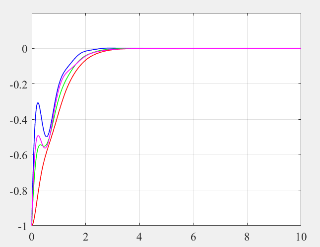
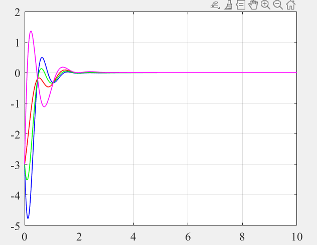

# Test_Simple_Distri_Obs
 DIstributied Observer

1 ) Run the file :  init_simulink_DO.m .

2 ) Run the file : simulink distributed_UIO_4nodes_directed.slx . 

3 ) Run the file : draw_4node_errors.m 

The same results , found in "A Simple Approach to Distributed Observer Design for Linear Systems"
## Error 1 , Fig4 in the paper

## Error 2 , Fig5 in the paper

